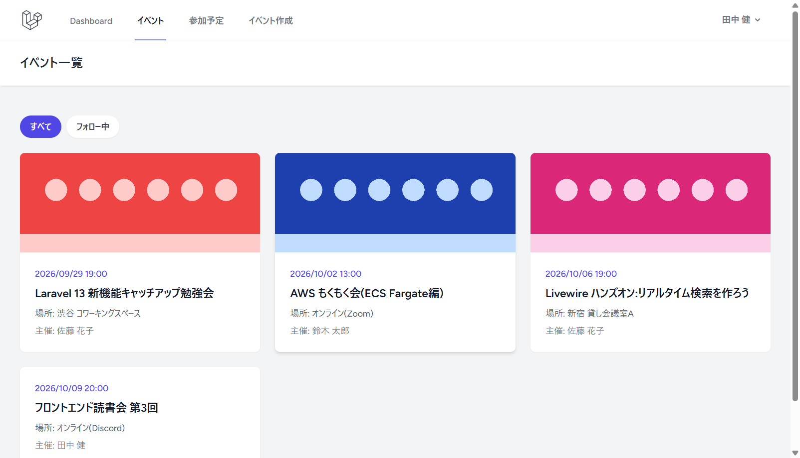
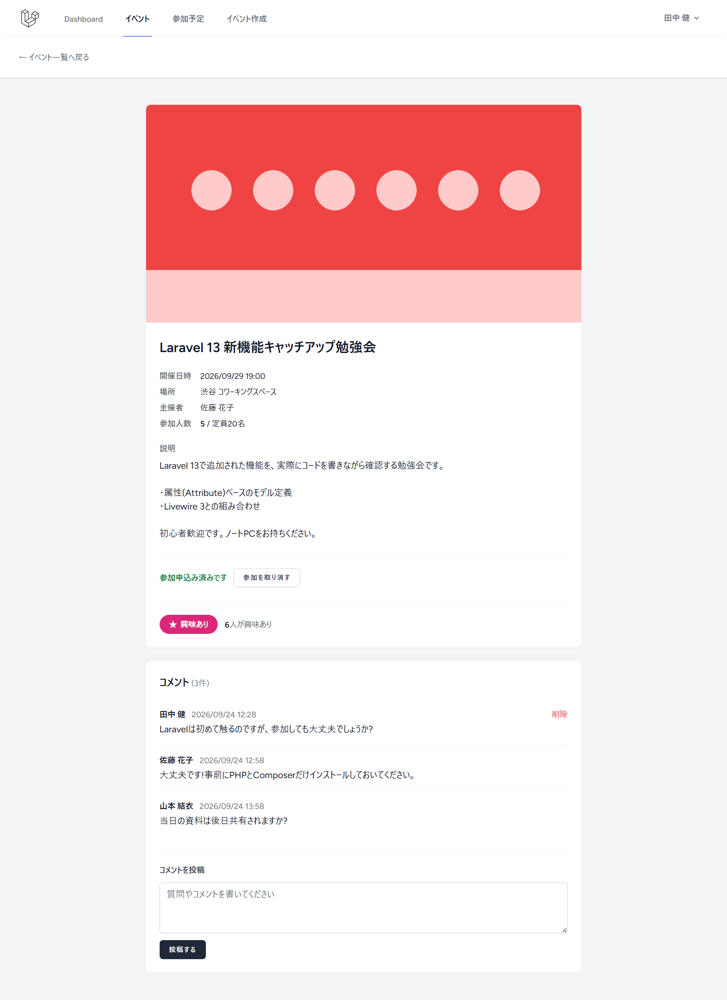
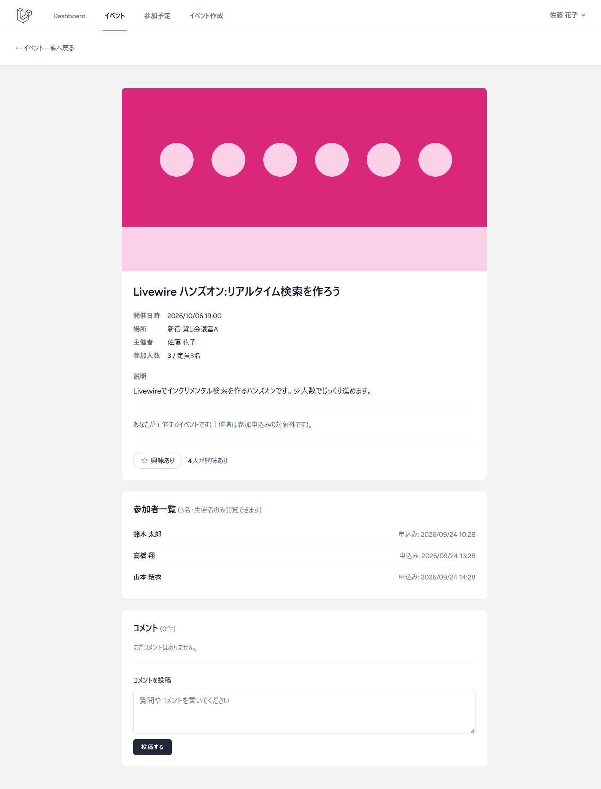
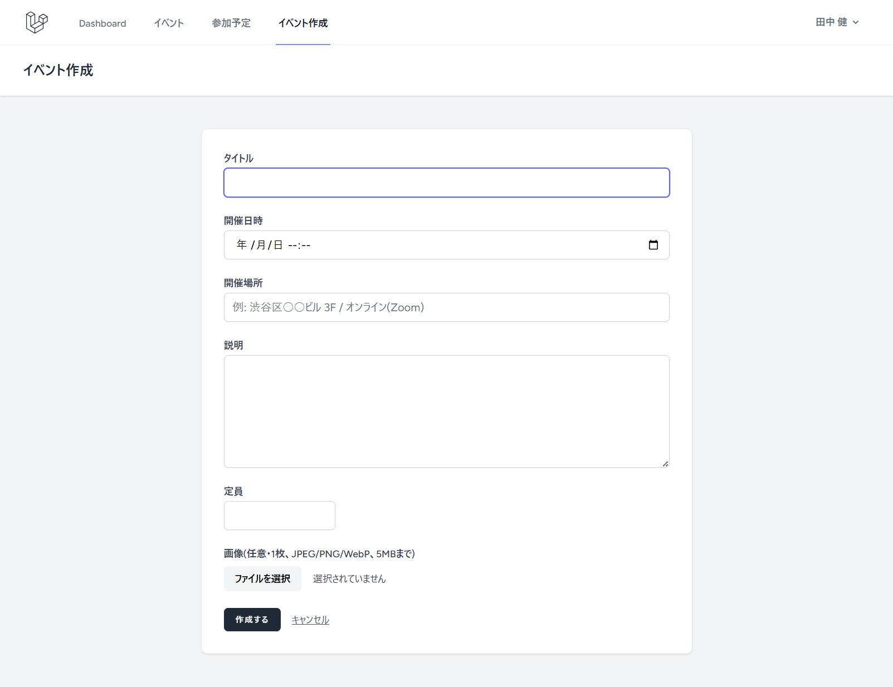
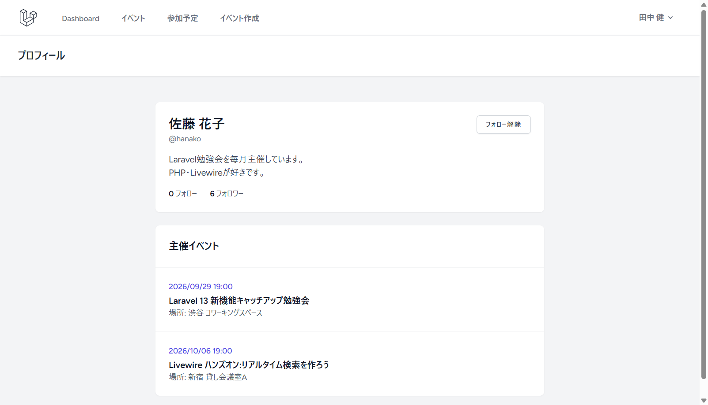

# MeetHub

勉強会・イベント掲示板アプリ。主催者がイベント(勉強会・もくもく会等)を投稿し、参加希望者が「興味あり」・コメント・参加申込みを行い、主催者をフォローして新着イベントを追いかけられる。詳細な要件・設計は[docs/](./docs/)を参照。

- 本番環境(AWS): https://d1tlmxx5mb206.cloudfront.net (課題の確認が終わったら削除する前提のため、URLは変わる・アクセスできなくなる場合がある)

## 主な機能

- アカウント: ユーザー登録・ログイン・ログアウト、プロフィールの表示・編集(表示名・メールアドレス・パスワード)
- イベント: 作成・編集・削除(主催者本人のみ)、画像1枚の添付(本番はブラウザからS3へ直接アップロード)、開催日時を過ぎたイベントは「終了」扱い
- イベント一覧(すべて / フォロー中の主催者)・詳細
- 興味あり(いいね)・コメント
- フォロー / フォロー解除、フォロー一覧・フォロワー一覧
- 参加申込み・取消し、定員管理(同時申込みでも定員を超えないよう行ロックで排他制御)、マイ参加予定一覧、参加者一覧(主催者のみ閲覧可)

## スクリーンショット

ローカル環境にデモ用のデータを投入して撮影したもの。

| イベント一覧 | イベント詳細(参加者の画面) |
|---|---|
|  |  |
| 開催日時が近い順に表示し、「フォロー中」で主催者を絞り込める | 参加申込み・取消し、興味あり、コメントの投稿・削除(投稿者本人のみ) |

| イベント詳細(主催者の画面) | イベント作成 | プロフィール |
|---|---|---|
|  |  |  |
| 定員に達したイベント。参加者一覧は主催者のみ閲覧できる | タイトル・開催日時・場所・説明・定員・画像を入力する | 自己紹介・フォロー数・主催イベント。フォロー / フォロー解除 |

## ドキュメント

- [要件定義書](./docs/requirements.md)
- [技術スタック](./docs/tech-stack.md)
- [画面設計](./docs/screen-design.md)
- [データ設計](./docs/database-design.md)
- [構造化ログ・ヘルスチェック](./docs/observability.md)
- [運用ガイド(ログ調査・簡易インシデント対応)](./docs/operations-guide.md)
- [k6負荷試験](./k6/README.md)
- [インフラ構成(AWS本番環境)](./docs/infrastructure.md)・[構築・デプロイ手順](./infra/production/README.md)

## 技術スタック(概要)

PHP 8.5 + Laravel 13 + Livewire 3.8(Volt 1.11) + Blade + Tailwind CSS 3.4 + PostgreSQL 17。本番環境はAWS(CloudFront + ALB + ECS Fargate + RDS + S3)で、Terraform 1.15で構築している。詳細は[tech-stack.md](./docs/tech-stack.md)・[infrastructure.md](./docs/infrastructure.md)を参照。

## ローカル開発環境

ローカルにPHP 8.5 / Composerが入っていなくても、Docker ComposeだけでPHP・Node.js・PostgreSQLが揃った開発環境が起動できる。

### 前提

- Docker / Docker Compose

### セットアップ

```bash
# 1. 環境変数ファイルを作成
cp .env.example .env

# 2. アプリ用コンテナのビルド
docker compose build

# 3. PostgreSQLコンテナを起動
docker compose up -d pgsql

# 4. PHP依存関係をインストール(初回のみ。以降は composer.lock 変更時に実行)
docker compose run --rm app composer install

# 5. アプリケーションキーを生成
docker compose run --rm app php artisan key:generate

# 6. フロントエンドアセット(Tailwind CSS等)のビルド
docker compose run --rm app npm install
docker compose run --rm app npm run build

# 7. マイグレーションを実行
docker compose run --rm app php artisan migrate

# 8. アップロード画像を公開するためのシンボリックリンク(public/storage)を作成
docker compose run --rm app php artisan storage:link
```

※ ホストの5432番ポートが他プロジェクトのPostgreSQLで使用中の場合は、先にそちらを停止するか、`docker-compose.yml`のポートマッピングを変更すること(CLAUDE.mdのポート運用ルール参照)。

### アプリケーションの起動

```bash
docker compose up -d app
```

`http://localhost:8000` にアクセスし、新規登録・ログイン・ログアウトが動作することを確認する。

停止する場合:

```bash
docker compose down
```

### ファイル保存先(画像アップロード)

`.env`の`FILESYSTEM_DISK`で切り替える。ローカル開発は`public`(`storage/app/public`に保存、AWS認証情報は不要)、本番は`s3`(ブラウザからS3へ署名付きURLで直接アップロード。`AWS_*`の設定が必要)。詳細は[tech-stack.md](./docs/tech-stack.md#ストレージ--aws連携)を参照。

なお、アプリのタイムゾーンは`Asia/Tokyo`(`config/app.php`)で、イベントの開催日時は日本時間として入力・表示・「終了」判定する。

### テストの実行(Pest)

```bash
docker compose run --rm app php artisan test
```

通常のテスト(`phpunit.xml`)はSQLiteのインメモリDBで実行する。参加申込みの同時実行制御(行ロック)はDB製品によって挙動が異なるため、`tests/Concurrency`のテストは本番と同じPostgreSQL上で、`phpunit.pgsql.xml`を使って実行する(全テストもあわせてPostgreSQLで実行される)。`php artisan test`は`phpunit.xml`を自動で指定するため`--configuration`と併用できない(二重指定の警告で終了コードが1になる)ので、Pestを直接実行する。

```bash
# 初回のみ: テスト用データベースを作成
docker compose exec pgsql psql -U meethub -d meethub -c "create database meethub_testing"

docker compose run --rm app ./vendor/bin/pest --configuration=phpunit.pgsql.xml
```

### E2Eテストの実行(Pestのブラウザテスト)

代表的なユーザージャーニーと主要画面のアクセシビリティ検査を、Pestのブラウザテスト機能(`pestphp/pest-plugin-browser`、内部でPlaywrightのChromiumを使用)で実行する。テストは`tests/Browser`にあり、PostgreSQL上で実行するため`phpunit.pgsql.xml`の`Browser`テストスイートとして実行する。

| ファイル | 内容 |
|---|---|
| `tests/Browser/UserJourneyTest.php` | 主催者(新規登録→イベント作成→編集→削除)、参加者(新規登録→詳細→いいね→コメント→参加申込み→参加予定一覧→取消し)、フォロー(ログイン→フォロー→「フォロー中」タブ→フォロー解除)の3本 |
| `tests/Browser/AccessibilityTest.php` | ログイン・登録・イベント一覧・イベント詳細(参加者/主催者)・プロフィール画面をaxe-core(デフォルトルールセット、影響度minorまで全て)で検査する。違反が見つかった場合は、テストではなく画面(Blade・Livewireコンポーネント)を修正する |

```bash
# 画面のアセット(CSS/JS)がビルドされている必要がある(未ビルドの場合)
docker compose run --rm app npm run build

docker compose run --rm app ./vendor/bin/pest --configuration=phpunit.pgsql.xml --testsuite=Browser
```

- ブラウザ(Chromium)とその実行に必要なライブラリはDockerイメージに含めている(`Dockerfile`)。`package.json`のplaywrightのバージョンを上げた場合は、`Dockerfile`のバージョンも揃えてイメージを作り直す(`docker compose build app`)
- アプリは別途起動しておく必要はない(Pestがテストと同じプロセス内でHTTPサーバーを起動し、テストと同じDB接続を使う)
- 失敗した場合、失敗時点の画面のスクリーンショットが`tests/Browser/Screenshots/`に保存される(Git管理対象外)
- `phpunit.pgsql.xml`で`--testsuite`を指定せずに実行すると、E2Eテストも含めた全テストが実行される

### コード品質チェック

```bash
# コードスタイル(Laravel Pint)
docker compose run --rm app ./vendor/bin/pint

# 静的解析(Larastan)
docker compose run --rm app ./vendor/bin/phpstan analyse
```

## CI/CD

GitHub Actionsで、テストと本番へのデプロイを自動化している。

- **CI**(`.github/workflows/ci.yml`): push・PR時にLaravel Pint・Larastan・Pestのテスト(SQLite・PostgreSQLの両方)と、E2Eテスト(ユーザージャーニー・アクセシビリティ検査。PostgreSQLのサービスコンテナを使用)を自動実行する。E2Eテストが失敗した場合は、スクリーンショットをアーティファクト(`e2e-screenshots`)として保存する。k6による負荷試験は、CIの実行環境の性能が変動するためCIでは実行しない([k6/README.md](./k6/README.md))
- **CD**(`.github/workflows/cd.yml`): mainへのpushで動いたCIが成功すると、本番用のDockerイメージをビルドしてECRへpushし、ECS Fargateのサービスを新しいタスク定義のリビジョンに更新する。AWSの認証はOIDC(長期間有効なアクセスキーを使わない)。設計は[infrastructure.md](./docs/infrastructure.md#cd継続的デプロイ)、ロールバック等の手順は[infra/production/README.md](./infra/production/README.md#デプロイ)を参照
